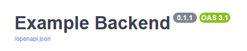
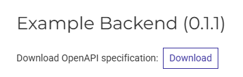
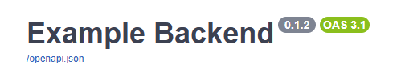

# Reuse Project Version from `pyproject.toml` for FastAPI

> tl;dr: Jump to [final code example](#final-code-example).

FastAPI provides a [`version` attribute](https://fastapi.tiangolo.com/tutorial/metadata/#metadata-for-api) to document the version of your backend application.

## Naive Example
In this example, the version number `0.1.1` is hard-coded into the FastAPI class:
```python 
from fastapi import FastAPI


app = FastAPI(
	title="Example Backend",
	version="0.1.1",
	...
)
```

FastAPI will show the version number `0.1.1` in all generated API documentations.

Swagger UI OpenAPI documentation (`/docs`):  


Redoc OpenAPI documentation (`/redoc`):  


Since the version is hard-coded, you would need to update it manually in the code every time the backend version changes.


## Load Version from `pyproject.toml` into FastAPI
When you are using [semantic versioning](https://semver.org/) together with a `pyproject.toml` file to version and deploy your application, you are likely using the `version` key in `pyproject.toml` as leading attribute in your code base to document the version of your application:
```toml
# pyproject.toml
[project]
name = "example-backend"
version = "0.1.1"
...
```

Therefore, we could read the version from the `pyproject.toml` file and pass it as value directly to FastAPI to avoid redundant hard-coded version declarations.

The package `pydantic-settings`, which is often used together with FastAPI, supports reading values from the `pyproject.toml` file directly. So using it to read in values seems practical.

The idea is to import the Pydantic settings object and pass the version number from the `pyproject.toml` file directly to FastAPI:
```python
settings = Settings()
app = FastAPI(
    title="Example Backend",
    version=settings.project.version,
)
```

The Pydantic documentation describes how to read in values from a `pyproject.toml` file:
https://docs.pydantic.dev/latest/concepts/pydantic_settings/#pyprojecttoml

There is some boilerplate code needed to configure Pydantic to load values from a `pyproject.toml` file:
```python
model_config = SettingsConfigDict(
    pyproject_toml_depth=1,  # (1)
    pyproject_toml_table_header=("project",),  # (2)
    extra="ignore",  # (3)
)
```
1. We need to specify where the `pyproject.toml` file is located. By default Pydantic will only look at the current working directory (where the Python executable was started). This is often the `src/` folder of an application. The `pyproject.toml` file is normally in the parent folder of the `src/` folder (the root folder of the project). In that case, setting `pyproject_toml_depth=1` means, Pydantic will also search the parent folder for a `pyproject.toml` file.
2. A TOML file is divided into tables (sections). We want to extract the `version` key from the `project` table. This is the standard structure of a [`pyproject.toml` file](https://packaging.python.org/en/latest/specifications/pyproject-toml/#declaring-project-metadata-the-project-table). Therefore, we are telling Pydantic to load values from the `project` table of the file.
3. Besides a key `version`, the `project` table of the `pyproject.toml` will contain more keys. When we only define the `version` field in our Pydantic settings class, Pydantic would raise a validation error due to other unexpected keys in the `project` table of the `pyproject.toml` file. Therefore, we need to tell Pydantic, that this is ok, and it should just ignore any additional key.

Furthermore, we need to add the following class method to our Pydantic settings class as well:
```python
@classmethod
def settings_customise_sources(
	cls,
	settings_cls: type[BaseSettings],
	init_settings: PydanticBaseSettingsSource,
	env_settings: PydanticBaseSettingsSource,
	dotenv_settings: PydanticBaseSettingsSource,
	file_secret_settings: PydanticBaseSettingsSource,
) -> tuple[PydanticBaseSettingsSource, ...]:
	"""Read values from the `project` table in the `pyproject.toml` file as first priority.

	Customises priority for reading settings from sources.

	Args:
		settings_cls (type[BaseSettings]): The Settings class.
		init_settings (PydanticBaseSettingsSource): The `InitSettingsSource` instance.
		env_settings (PydanticBaseSettingsSource): The `EnvSettingsSource` instance.
		dotenv_settings (PydanticBaseSettingsSource): The `DotEnvSettingsSource` instance.
		file_secret_settings (PydanticBaseSettingsSource): The `SecretsSettingsSource` instance.

	Returns:
		tuple[PydanticBaseSettingsSource, ...]: A tuple with sources in their order for loading settings values.
	"""
	setting_source_order = super().settings_customise_sources(
		settings_cls=settings_cls,
		init_settings=init_settings,
		env_settings=env_settings,
		dotenv_settings=dotenv_settings,
		file_secret_settings=file_secret_settings,
	)

	# add pyproject.toml file as first priority source when loading the settings
	return (PyprojectTomlConfigSettingsSource(settings_cls), *setting_source_order)
```

The class method above overwrites the `settings_customise_sources` method of the `BaseSettings` class.
This is necessary to change the priority of which settings source is tried first to load the expected values.

Reading values from a `pyproject.toml` file is not part of the [default order](https://docs.pydantic.dev/latest/concepts/pydantic_settings/#field-value-priority).
Therefore, we add the class `PyprojectTomlConfigSettingsSource` as first priority to the tuple of settings sources, which Pydantic should use to fill the fields in the settings class with values. The argument `settings_cls` contains our actual Pydantic settings class including the `model_config`, which we have defined above. It will be used to tell the class `PyprojectTomlConfigSettingsSource` where to find the `pyproject.toml` file and the values in it.

There are some advantages and disadvantages of the sketched-out approach of using `pydantic-settings` for reusing the version number from the `pyproject.toml` file for FastAPI.

Advantages:
* avoid redundant version declarations, which reduces manual work when updating the application’s version number
* small dependency footprint (You probably have `pydantic-settings` installed already. No other third-party dependency is needed for Python 3.11 or newer. Pydantic uses the new standard library `tomllib`. But otherwise you need to install `tomli` in addition.)
* could be extended to load other values from `pyproject.toml` as well to configure your backend application

Disadvantages:
* some boilerplate code is required to configure Pydantic to load values from `pyproject.toml`
* you need to make sure that the `pyproject.toml` file is deployed together with your application
* for Python versions before Python 3.11, you need to install `pydantic-settings[toml]` or `tomli` explicitly


## Final Code Example
> **Note:**
> * You will find the [full code example here](https://github.com/LoHertel/fastapi-tutorial/blob/main/articles/fastapi-version-in-openapi/src).
> * Make sure you have added the Python package `pydantic-settings` to your application. When you are using `fastapi[all]`, it is already installed.
> * For Python versions before Python 3.11, you need to install TOML support explicitly: `pydantic-settings[toml]`

File tree:
```
.
├── src/
│   ├── main.py
│   └── settings.py
│
├── pyproject.toml
└── ...
```

```python
# main.py
from fastapi import FastAPI

from settings import AppSettings

settings = AppSettings()

app = FastAPI(
    title="Example Backend",
    version=settings.project.version,
)
```

```python
# settings.py
from pydantic import ValidationInfo, field_validator
from pydantic_settings import (
    BaseSettings,
    PydanticBaseSettingsSource,
    PyprojectTomlConfigSettingsSource,
    SettingsConfigDict,
)


class ProjectSettings(BaseSettings):
    """Loading values from the `project` table of the `pyproject.toml` file.

    If a specified key is not found in the `project` table in the `pyproject.toml` file,
    Pydantic will try to use its other default setting sources to load the value from,
    and fall back to the default field value defined in this class.
    Docs: https://docs.pydantic.dev/latest/concepts/pydantic_settings/#pyprojecttoml
    """

    version: str = "0.1.0"  # default value is identical to FastAPI's default version value

    # all remaining code in this class is needed for Pydantic to load values from the `project` table in pyproject.toml
    # you can ignore this unless you want to understand the internal behavior
    model_config = SettingsConfigDict(
        extra="ignore",
        pyproject_toml_depth=1,  # pyproject.toml file is in the parent directory relative to the `src/` folder
        pyproject_toml_table_header=("project",),  # read keys from table `project` in `pyproject.toml`
    )

    @classmethod
    def settings_customise_sources(
        cls,
        settings_cls: type[BaseSettings],
        init_settings: PydanticBaseSettingsSource,
        env_settings: PydanticBaseSettingsSource,
        dotenv_settings: PydanticBaseSettingsSource,
        file_secret_settings: PydanticBaseSettingsSource,
    ) -> tuple[PydanticBaseSettingsSource, ...]:
        """Read values from the `project` table in the `pyproject.toml` file as first priority.

        Customises priority for reading settings from sources.

        Args:
            settings_cls (type[BaseSettings]): The Settings class.
            init_settings (PydanticBaseSettingsSource): The `InitSettingsSource` instance.
            env_settings (PydanticBaseSettingsSource): The `EnvSettingsSource` instance.
            dotenv_settings (PydanticBaseSettingsSource): The `DotEnvSettingsSource` instance.
            file_secret_settings (PydanticBaseSettingsSource): The `SecretsSettingsSource` instance.

        Returns:
            tuple[PydanticBaseSettingsSource, ...]: A tuple with sources in their order for loading settings values.
        """
        setting_source_order = super().settings_customise_sources(
            settings_cls=settings_cls,
            init_settings=init_settings,
            env_settings=env_settings,
            dotenv_settings=dotenv_settings,
            file_secret_settings=file_secret_settings,
        )

        # add pyproject.toml file as first priority source when loading the settings
        return (PyprojectTomlConfigSettingsSource(settings_cls), *setting_source_order)


class AppSettings(BaseSettings):
    """Settings for the application."""

    environment: str = "DEV"
    project: ProjectSettings = ProjectSettings()

```

```toml
# pyproject.toml
[project]
name = "example-backend"
version = "0.1.2"
description = "Example Backend"
readme = "README.md"
authors = [{ name = "Your Name", email = "you@example.com" }]
license = "MIT"
requires-python = ">=3.11, <4"
```

🎉 When running the backend now, it will show the current version number from your `pyproject.toml` file in the API docs.  


## Extend it with Your Own Ideas
You could try to add additional values from your `pyproject.toml` file to your Pydantic settings and use them to configure FastAPI, for example:
```python
app = FastAPI(
	title=settings.project.description,
	version=settings.project.version,
	license_info={
		"name": settings.project.license,
        "identifier": settings.project.license,
	}
	...
)
```

## Repository
You will find the [full code example here](https://github.com/LoHertel/fastapi-tutorial/blob/main/articles/fastapi-version-in-openapi/src).

### 1. Clone the repository
```bash
git clone git@github.com:LoHertel/fastapi-tutorial.git
```

### 2. Go to the code example
```bash
cd fastapi-tutorial/articles/fastapi-version-in-openapi
```

### 3. Set up a virtual environment
> You need to have [`uv`](https://github.com/astral-sh/uv) installed to setup the virtual environment.
>
> Using `pipx` to install `uv` is recommended, because it avoids package version conflicts (see the [pipx docs](https://pipx.pypa.io/)):
> ```bash
> pipx install uv
> ```
> Otherwise, consult the documentation for other [installation methods](https://docs.astral.sh/uv/getting-started/installation/).
```bash
uv sync
```

### 4. Run FastAPI
```bash
uv run --directory=src uvicorn main:app --host 127.0.0.1 --port 8000 --reload
```

### 5. Open OpenAPI documentation
http://127.0.0.1:8000/docs
