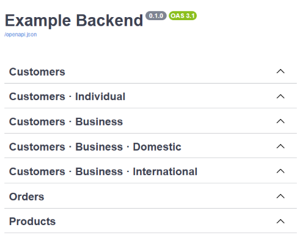
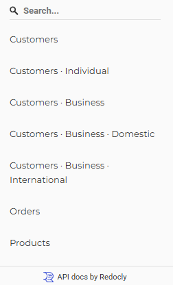

# Workaround for Hierarchical Tags in FastAPI

The current OpenAPI specification and FastAPI do not support organizing tags in a nested, hierarchical fashion. 
Therefore, it's not currently possible to display nested tags like this in the generated API documentation:
* Customers
  * Individual Customers
  * Business Customers
    * Domestic
    * International
* Orders
* Products

> Note: Support for [hierarchical tags](https://github.com/OAI/OpenAPI-Specification/pull/4288) is expected to arrive in the OpenAPI specification 3.2.0 at the earliest, which is currently planned for August 2025. After that, FastAPI and Swagger UI / Redoc will also need to adopt the new version. I don't expect these changes to be available any time soon.

Therefore, I'm describing a workaround for the time being which is [based on the idea](https://stackoverflow.com/a/41803677/8057078) of resembling a hirarchical structure inside of tag names.

## Workaround

Currently, OpenAPI supports only a flat list of tags. To make them look like they are nested, you could insert the full hierarchy in each tag name:

* Customers
* Customers · Individual
* Customers · Business
* Customers · Business · Domestic
* Customers · Business · International
* Orders
* Products

This can be done in FastAPI by defining a list of tags in the following format ([see documentation](https://fastapi.tiangolo.com/tutorial/metadata/#metadata-for-tags)):
```python
# the order of the tags defines the order of the groups shown in the API documentation
tags_metadata: list[dict[str, Any]] = [
    {
        "name": "Customers",
    },
    {
        "name": "Customers · Individual",
    },
    {
        "name": "Customers · Business",
    },
    {
        "name": "Customers · Business · Domestic",
    },
    {
        "name": "Customers · Business · International",
    },
    {
        "name": "Orders",
    },
    {
        "name": "Products",
    },
]

app = FastAPI(
    title="Example Backend",
    openapi_tags=tags_metadata,
)
```

In Swagger UI (`/docs`), even longer hierarchical names are clearly visible:  


In Redoc (`/redoc`), the tag names are shown in the sidebar on the left. There is not enough space to show longer hierarchical names in one line. Therefore, "Customers · Business · International" is wrapped to the next line:  


> Note: In the example above, you can see that "Customers · Individual" is listed before "Customers · Business". The tags are not sorted alphabetically, but shown in the order, in which they are passed to `openapi_tags`. Therefore, you are able to organize the tags in a custom order if needed.

## Simplify Tag Management

The workaround works best when creating a full list with all tag names and passing them to FastAPI.

But in addition, you also need to add the tag name to each endpoint in FastAPI. Therefore, you will need to use the exact same tag names in multiple parts of the code. This might be a bit cumbersome, especially because the tag names might be quite long and are following a specific naming convention.

Therefore, I suggest defining all tags as `Enum` at a central location in the code:

```python
# tags.py
from enum import Enum
from typing import Any


class Tags(str, Enum):
    customers = "Customers"
    customers_individual = "Customers · Individual"
    customers_business = "Customers · Business"
    customers_business_domestic = "Customers · Business · Domestic"
    customers_business_international = "Customers · Business · International"
    orders = "Orders"
    products = "Products"


# the order of the tags in the Enum class defines the order of the tags in the API documentation
tags_metadata: list[dict[str, Any]] = [{"name": tag.value} for tag in Tags]
```

The defined tags can be used in FastAPI endpoints like so (`tags=[Tags.customers_individual]`):
```python
# main.py
from fastapi import FastAPI

from tags import Tags, tags_metadata

app = FastAPI(
    title="Example Backend",
    openapi_tags=tags_metadata,
)

@app.get("/v1/customer/b2c", tags=[Tags.customers_individual])
async def list_b2c_customers() -> list[Customer]:
    pass

```
Now, you are able to make all changes to the tag names at a central  location `tags.py`.


## Summary

You will find the [full code example here](https://github.com/LoHertel/fastapi-tutorial/blob/main/articles/hierarchical-tags-workaround/src).

Advantages:
* by including parent categories in the tag names, the Swagger UI and Redoc documentation visually reflects a hierarchical structure
* works best in Swagger UI, because it fully displays even longer tag names
* workaround does not require substantial coding efforts
* workaround is compatible with the currently used OpenAPI version 3.1.0 in FastAPI, no need to wait until OpenAPI 3.2.0 is supported by FastAPI, which has no ETA yet

Disadvantages:
* if you are using Redoc, you need to limit the length of tag names to prevent unpleasant line wraps
* the workaround is purely cosmetic — both Swagger UI and Redoc are not able to show tags as truly nested structures due to the limitations of the current OpenAPI specification


## Additional Tip for Swagger UI

By default, Swagger UI displays all endpoints when rendering the documentation. 

It might help users better understand the API structure if all tag groups are collapsed by default.

Swagger UI will collapse the tag groups automatically when adding `swagger_ui_parameters={"docExpansion": "none"}` to FastAPI.
```python
app = FastAPI(
    title="Example Backend",
    openapi_tags=tags_metadata,
    swagger_ui_parameters={"docExpansion": "none"},  # collapses all tags
)
```

## Repository
You will find the [full code example here](https://github.com/LoHertel/fastapi-tutorial/blob/main/articles/hierarchical-tags-workaround/src).

### 1. Clone the repository
```bash
git clone git@github.com:LoHertel/fastapi-tutorial.git
```

### 2. Go to the code example
```bash
cd fastapi-tutorial/articles/hierarchical-tags-workaround
```

### 3. Set up a virtual environment
> You need to have [`uv`](https://github.com/astral-sh/uv) installed to setup the virtual environment.
>
> Using `pipx` to install `uv` is recommended, because it avoids package version conflicts (see the [pipx docs](https://pipx.pypa.io/)):
> ```bash
> pipx install uv
> ```
> Otherwise, consult the documentation for other [installation methods](https://docs.astral.sh/uv/getting-started/installation/).
```bash
uv sync
```

### 4. Run FastAPI
```bash
uv run --directory=src uvicorn main:app --host 127.0.0.1 --port 8000 --reload
```

### 5. Open OpenAPI documentation
http://127.0.0.1:8000/docs
