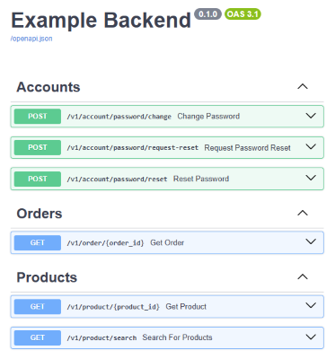

# Use OpenAPI Tags to Document Groups of Endpoints in FastAPI


> tl;dr: Jump to [code example](#implementation-in-fastapi) directly.

Do you enjoy clear and helpful API documentation as a developer?

Grouping endpoints into categories helps other developers navigate your API more easily and provides a clearer overview of its structure.

In the screenshot above, endpoints are clearly organized into groups. Each group has a brief description and, optionally, links to relevant external resources.

These groups are referred to as **`tags`** in FastAPI and the OpenAPI specification. In this post, you'll learn how to use them to enhance your FastAPI documentation.

## What are Tags Used for?

In FastAPI, tags allow you to group related API endpoints in the auto-generated OpenAPI documentation. This improves navigation and helps developers understand your API easier.

Each tag can represent a system module or a bounded context, making it easier for developers to find endpoints related to a specific part of the application.

For example, in the screenshot below, the tags "Accounts," "Orders," and "Products" are used to organize endpoints into sections in Swagger UI (a documentation tool included with FastAPI):


> 💡 **Advanced Tip:**  
> If an endpoint belongs to multiple contexts, you can assign multiple tags to it. The endpoint will then appear under each corresponding section in the documentation.

## Enrich Tags with Additional Information

The [OpenAPI specification](https://spec.openapis.org/oas/latest.html#tag-object) allows you to enhance tags with a **description** and a **URL**.

### Description
Adding a description to a tag in FastAPI provides helpful context.

When you are using **Swagger UI** to serve your API documentation, the description appears next to each tag's name in the header of each section. Try to limit the length of the description text. Otherwise, the section heading element in the UI might be overloaded with text.:  


In **Redoc**, descriptions are shown as introductory text in the main content area when a tag is selected:


Since Redoc has more space for descriptions, you can provide longer, more detailed explanations there. In contrast to Swagger UI, tag descriptions are not shown together with the tag name in the navigation panel. This changes the purpose of the description field a bit, depending which tool you are using.

To summarize, **Redoc** enables tag descriptions to be a longer introductory paragraph which is only shown when the user selects a tag, where as in **Swagger UI**, tag descriptions are used for brief definitions for each tag and are displayed right away.

> 💡 **Advanced Tip:**  
> Have you noticed the use of **bold** and *italic* in the example descriptions in the screenshots above? The OpenAPI specification supports markdown to enrich the text.
>
> Even Markdown lists and tables are supported. Use these features with care. Only Redoc offers enough UI real estate to display more extensive descriptions nicely.

### URL
You can associate each tag with a URL pointing to external resources. The purpose is to link to an external documentation. But this URL could point to basically anything, e.g. to a specific frontend or system. The text of the link can be customized as well to clearly communicate the purpose of the URL.


> 💡 **Advanced Tip:**  
> If you want to use an icon at the beginning of your link text to visually communicate its purpose, you could add an emoji character.

> 💬 **Personal Note:**  
> I aim to make the OpenAPI documentation as complete as possible, so I rarely rely on a separate documentation, which needs to be linked. This way, I can use the external links to point to other relevant resources.


### Implementation in FastAPI
To add metadata to tags in FastAPI, create a dictionary for each tag (see [documentation](https://fastapi.tiangolo.com/tutorial/metadata/#metadata-for-tags)):
```json
{
    "name": "Products",
    "description": "A product is an **item** that can be purchased by a *customer*.",
    "externalDocs": {
        "description": "📚 Product Catalog",
        "url": "https://example.net/products/"
    },
},
```

You can then pass a list of these tag dictionaries to the argument `openapi_tags` of the `FastAPI` constructor:
```python
# the order of the tags defines the order of the groups shown in the API documentation
tags_metadata: list[dict[str, Any]] = [
    {
        "name": "Accounts",
        "description": "An account allows a *customer* to **log in** and **manage their personal data**.",
        "externalDocs": {
            "description": "👤 User Management System",
            "url": "https://example.net/admin/users/",
        },
    },
    {
        "name": "Orders",
        "description": "An order is a **collection of products** that a *customer* has purchased.",
    },
    {
        "name": "Products",
        "description": "A product is an **item** that can be purchased by a *customer*.",
        "externalDocs": {
            "description": "📚 Product Catalog",
            "url": "https://example.net/products/",
        },
    },
]

app = FastAPI(
    title="Example Backend",
    openapi_tags=tags_metadata,
)

@app.get(path="/v1/product/{product_id}", tags=["Products"])
async def get_product(product_id: int) -> None:
    """Returns the product with the given ID."""
```

> 💡 **Advanced Tip:**  
> The tags are shown in the order, in which they are passed to `openapi_tags`. Therefore, you are able to organize the tags in a custom order if needed.

To assign the tag "Products" to an endpoint, add the argument `tags=["Products"]` to the endpoint decorator.

FastAPI requires using tag names in multiple places, which introduces some redundancy and might be a bit cumbersome, when you want to change the name of a tag later.
To avoid this, you can define your tags in a central `Enum`:
```python
# tags.py

from enum import Enum
from typing import Any


class Tags(StrEnum):
    accounts = "Accounts"
    orders = "Orders"
    products = "Products"

...
```

Now you can reference tags more consistently:

```python
# main.py

from tags import Tags

...

@app.get(path="/v1/product/{product_id}", tags=[Tags.products])
async def get_product(product_id: int) -> None:
    """Returns the product with the given ID."""
```


This makes future refactoring easier, when you want to change the name of a tag. Also, when renaming an enum key, the IDE can help changing all references of that enum automatically.


> 💡 **Advanced Tip:**  
> When using Redoc, multiline strings and [`textwrap.dedent()`](https://docs.python.org/3/library/textwrap.html#textwrap.dedent) are helpful to insert longer tag descriptions which require line breaks (e.g. Markdown lists):
> ```python
> from textwrap import dedent
> 
> tags_metadata = [
>     {
>         "name": "Customers",
>         "description": dedent("""
>             A **customer** is a person or organization that purchases products or services.
>             * **Individual customers** are managed in the private customer CRM (pCRM) system.
>             * **Business customers** are managed in the commercial customer CRM (cCRM) system.
> 
>             | Column A | Column B |
>             |----------|----------|
>             | key      | value    |
>             | key      | value    |
>         """),
>         "externalDocs": {
>             "description": "Domain Data Model",
>             "url": "https://example.net/docs/customers/",
>         },
>     },
> ]
> ```


## Summary

You can find the [full code example here](https://github.com/LoHertel/fastapi-tutorial/blob/main/articles/openapi-tag-metadata/src).

Advantages:
* tags help to organize endpoints for a better developer experience
* tag descriptions and external links allow to add helpful context
* FastAPI lets you customize the order of tags if needed
* refactor-friendly when using `Enum` for tag names (avoids duplication)

Disadvantages:
* tag descriptions are treated differently in Swagger UI and Redoc (choose one tool)


## Additional Tip for Swagger UI

By default, Swagger UI expands all tag groups when rendering the documentation. 
It might help users better understand the API structure if all tag groups are collapsed by default.

Swagger UI will collapse the tag groups automatically when adding `swagger_ui_parameters={"docExpansion": "none"}` to FastAPI.
```python
app = FastAPI(
    title="Example Backend",
    openapi_tags=tags_metadata,
    swagger_ui_parameters={"docExpansion": "none"},  # collapses all tags
)
```

## Repository
You will find the [full code example here](https://github.com/LoHertel/fastapi-tutorial/blob/main/articles/openapi-tag-metadata/src).

### 1. Clone the repository
```bash
git clone git@github.com:LoHertel/fastapi-tutorial.git
```

### 2. Go to the code example
```bash
cd fastapi-tutorial/articles/openapi-tag-metadata
```

### 3. Set up a virtual environment
> You need to have [`uv`](https://github.com/astral-sh/uv) installed to setup the virtual environment.
>
> Using `pipx` to install `uv` is recommended, because it avoids package version conflicts (see the [pipx docs](https://pipx.pypa.io/)):
> ```bash
> pipx install uv
> ```
> Otherwise, consult the documentation for other [installation methods](https://docs.astral.sh/uv/getting-started/installation/).
```bash
uv sync
```

### 4. Run FastAPI
```bash
uv run --directory=src uvicorn main:app --host 127.0.0.1 --port 8000 --reload
```

### 5. Open OpenAPI documentation
http://127.0.0.1:8000/docs
